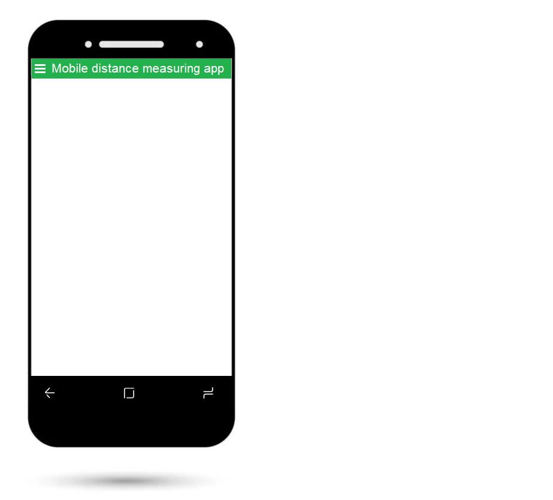
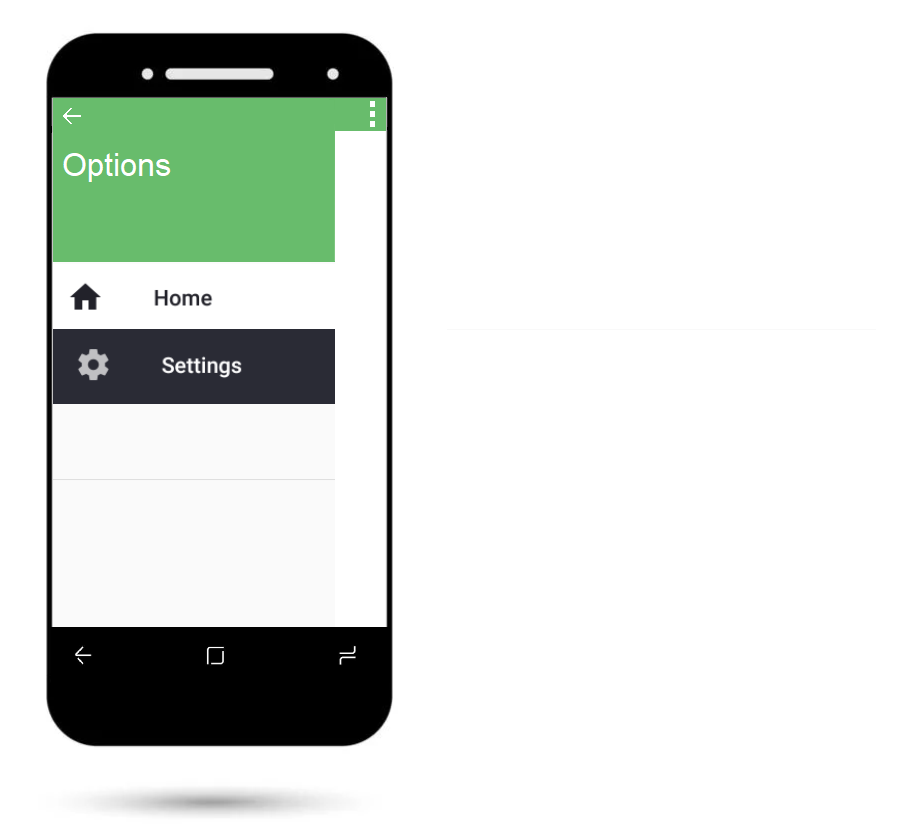
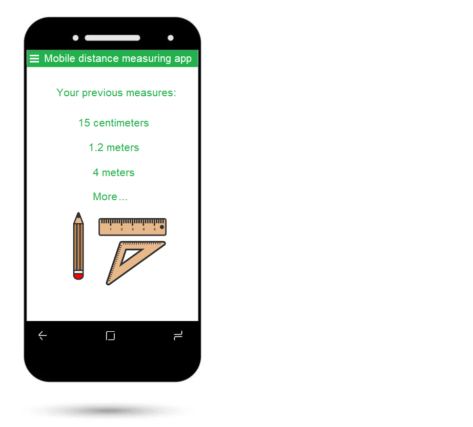

# Mobile Measurement funkcióspecifikáció

## 1. Jelenlegi helyzet
A megrendelőnk egy bútorfuvarozással foglalkozó cég, akik kicsit modernizálni szeretnék a munkafolyamataikat az új technológiai vívmányok felhasználásával. A megrendelővel való konzultáció során kiderült, hogy jelenleg a távolságot hagyományos eszközökkel mérik (vonalzó, mérőszalag). 

A megrendelő jó ötletnek tartotta, hogy modernizáljunk kicsit ezen a folyamaton azzal, hogy a kijáró kollégáik mobiltelefonjaira egy alkalmazást telepítsünk.

Ezzel a lépéssel egy eszközre cserélnék az eddig használt korábbi eszközöket és anyagi ráfordítást is csak addig jelent, ameddig az alkalmazást fejlesztjük, utána külön ráfordítást nem igényel, hiszen minden munkatársuknak van okostelefonja.

## 2. Vágyott rendszer
A mérések során a mérni kívánt távolságot a mobiltelefon szenzoraival végezzük. A távolságot a mobil elmozdításával tudják mérni (a kezdőponttól a végpontik kell elmozdítani a telefont).

Különböző távolságok mérése egészen 5 méterig.

Az alkalmazás egyszerű használata, könnyű telepíthetősége.

Kizárólag Android operációs rendszeren működő, Android 6.0 verzióig (Marshmallow) visszanyúló támogatás.

Függőleges és vízszintes irányú mérések is legyenek végrehajthatóak.

A mérések legyenek eltárolva vagy helyileg vagy egy szerveren.

## 3. Jelenlegi üzleti folyamatok
* 3.1 Vonalzók, mérőszallagok, méterbotok beszerzése és pótlása éves szinten
* 3.2 Az adott bútor méretének mintavételezése:
     * 3.2.1 A bútor több szemszögből történő lemérése
     * 3.2.2 A kapott méretek azonos mértékegységekbe való átváltása.
* 3.3 A megfelelő tároló eszköz kiválasztása
* 3.4 A szállító eszköz rakterének a lemérése, hogy a bútor valóban befér-e
* 3.5 A bútor megrendelőhöz való elszállítása
* 3.6 A bútor átadása.

## 4. Igényelt üzleti folyamatok
* 4.1 A szoftver telepítése a munkások készülékére ami lehet a saját vagy a cég által biztosított készülék.
* 4.2 A szoftver működésének elmagyarázása a dolgozoknak.
* 4.3 A szoftver mükédésének bemutatása a gyakroltaban
* 4.4 Az adott bútor méretének mintavételezése:
* 4.5 A bútor több szemszögből történő lemérése
* 4.6 A megfelelő tároló eszköz kiválasztása
* 4.7 A szállító eszköz rakterének a lemérése, hogy a bútor valóban befér-e
* 4.8 A bútor megrendelőhöz való elszállítása
* 4.8 A bútor átadása.

## 5. A rendszerre vonatkozó szabályok

* Az alkalmazás működjön Android telefonokon (legalább Android 6.0 és fölötte)
* A mérésekből több típust hajtsunk végre, ami megnyílvánul a távolság, orientáció, szög és a mintavételezés gyakoriságának változásában is.
* A méréseknél a gravitációs gyorsulás kiszűréséhez használjunk Kálmán-szűrőt vagy lassú szűrőt.
* A méréseket tároljuk el offline vagy online módon.
     * Offline tárolás esetén mentsük el egy CSV fájlba a méréseket az adataival együtt. Ezt később manuálisan vagy automatizálva töltsük fel egy adatbázisba.
     * Online tárolás esetén töltsük fel egy adatbázisba a mérések eredményeit.
* A mérések legyenek beazonosíthatók valami alapján, csv esetén a telefon azonosítójával/típusával, dátumával és esetleges megnevezésével a mérésnek.
* Több telefonon is teszteljük a méréseket, amelyek alapján megfigyelhetjük az egyes telefonok pontosságát egyes területeken elvégzett mérésekkel. (Esetleg az adatok összességén egy statisztikát fogunk létrehozni az adatok vizualizálásával.)

## 6. Követelménylista

| ID | Név | Kifejtés|
| :-: | :-- | :-- |
| K01 | Android rendszer | Egyenlőre Android operációs rendszerre készül el a program, várhatóan Android 6.0 (Marshmallow) verzióig visszamenőleg lesz kompatibilis az alkalmazás |
| K02 | Telefon azonosítása | Az elvégzett mérések eltárolásához szükséges, hogy valami alapján be tudjuk azonosítani azt, hogy melyik telefonon lett elvégezve a mérés|
| K03 | Mérések tárolása offline | Ha nincs internet elérés, akkor tárolja el az alkalmazás az eddigi méréseket egy CSV állományba. Ezt vagy manuálisan feltöltjük az adatbázisba később, vagy automatizáljuk.|
| K04 | Mérések tárolása online | Ha van internetelérés és megvalósítjuk az adatbázist hozzá, akkor az alkalmazás töltse fel az eddig elvégzett méréseket az adatbázisba. |
| K05 | Adatbázis normalizálása | Ha adatbázist használunk, akkor legalább 3. normálformába hozzuk. |
| K06 | Mérések részletei | Az alkalmazásba az elvégzett mérésekhez több infót is el kell tárolni az adatbázisba, ezeket ideális lenne egy listából kiválasztani vagy valami más interaktív módon a felhasználónak. |
| K07 | Mérés nagysága | A felhasználó kiválasztja, hogy mekkora mérést végez el. Ez lehet 40 centiméter, 1 méter, 2 méter, 5 méter. |
| K08 | Mintavételezés gyakorisága | A felhasználó kiválasztja, hogy milyen mintavételezési gyakoriságot akar használni az adott mérés során. Ez akár lehet 10 Hz, 1 MHz, 1 KHz. (Például rövid távolságon nagy mintavételezés, de nagy távolságon akár kisebb mintavételezési gyakoriság)  |
| K09 | Telefon orientációja | Fel kell készíteni az alkalmazást, hogy tudjon a telefon síkba és állítva is tudjon mérni viszonylag pontosan a telefon. |
| K10 | Telefon szöge | Nézzük meg, hogy melyik pontosabb az adott telefonon, hogyha egy síkon más-más szögbe mérjük meg a távolságot. |
| K11 | Szűrők alkalmazása | A gravitációs gyorsulás kiszűréséhez használjunk kálmán szűrőt a mérések eredményéhez. |
| K12 | Tesztelés | Az alkalmazást tesztelni kell több telefonon is, mindegyik méréssel és mintavételezési gyakorisággal is, több orientációban. Ezeket egy adatbázisban összegyűjtük. Mindegyik telefonon körülbelül 3-5 mérést végezzünk el! |

## 7. Használati esetek

Feltételezzük azt hogy nem áll rendelkezésére semmilyen eszköz arra, hogy megmérje a távolságot. Mivel csak a telefonja van nála ezért a program segítségével megméri. 

## 8. Képernyőtervek
Az alap kinézete az alkalmazásunknak:

A menü gomb megnyomása után hasonló eredményt kapunk majd:

Az alkalmazás tárolni fogja a mérési eredményeket, ezeket külön menüpontban érhetjük majd el:

GitHub elérése a [képeknek](https://github.com/HPeti/SZFM_2021_10_TeamBFK_Mobile_Measurement/tree/master/Doc/Pictures).

A működéséről készült egy [interaktív demo](https://app.uizard.io/p/2c59f2b3), ami előzetesen bemutatja, milyen működést várhatunk az appunktól.

## 9. Forgatókönyvek

* Válaszd ki/ add meg a mérés ID-t. 
     * Ehhez a méréshez fog a statisztikába bekerülni a mérés.
* Válaszd ki,hogy a mérés beállításai milyenek legyenek.
     * mérés nagysága.
     * mintavételezés gyakorisága.
* Add meg hányszor akarod ismételni a mérést.
     * A mérés pontosságának növeléséhez több mérést hajtunk végre, esetleg igény esetén ezeket a méréseket átlagoljuk.
* Start gombbal el tudjuk indítani a mérést.
* Stop gombbal leállítjuk a mérést.
     * Megjelenik a mérés eredménye.
     * Elmenthetjük 
     * Újrakezdhetjük 
     * Továbbléphetünk a következő mérésre.
* Amint végeztünk az ismétlésekkel új mérést indíthatunk.

## 10. Fogalomszótár

**Kálmán szűrő:** egy algoritmus, mely mozgó, változó rendszerek állapotáról ad optimális becslést sorozatos mérésekkel, figyelembe véve az állapotméréseket és a zavaró tényezőket (zajok, bizonytalanságok, pontatlanságok). Ezzel az algoritmussal jóval pontosabb információ kapható a vizsgált tárgyról, mintha csak egy mérést végeznének el. Más szóval a Kálmán-szűrő a zajos bemenő adatok rekurzív mérésével egy optimális becslést ad a mérés tárgyának állapotáról.
Az algoritmus két lépésben működik. Az első becslési lépésben a Kálmán–szűrő kiszámolja az aktuális állapotváltozókat, a bizonytalanságokkal együtt. A következő mérés eredményeit súlyozott átlagolással veszi figyelembe. A sorozatos valós idejű mérések során az átlagolás eredményeként egyre jobb értékek adódnak, ahol a zajok és egyéb zavaró tényezők kiesnek. Az algoritmus rekurzív jellegű, csak az aktuális kalkulált állapotot, és az aktuális mérési eredményeket veszi figyelembe, korábban mért adatokat nem használ fel. Elméletileg, a Kálmán-szűrő alapfeltevése az, hogy a vizsgált rendszer egy lineáris dinamikus rendszer, és minden hibafüggvénynek és -mérésnek is normális eloszlása van (gyakran többváltozós a normális eloszlás).
