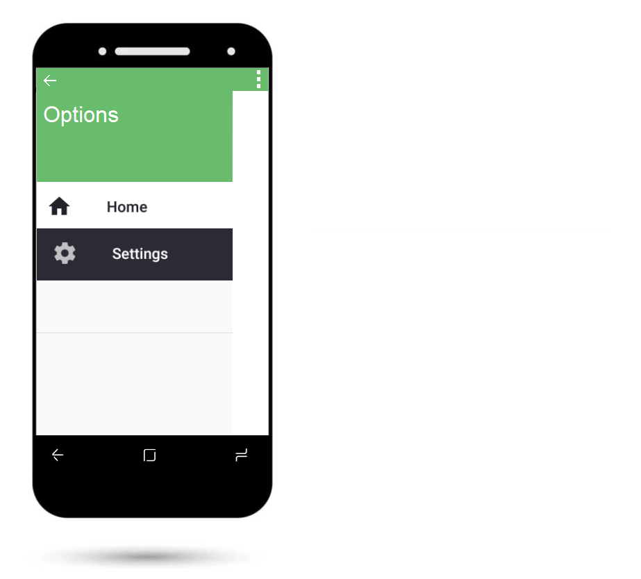

# Mobile Measurement rendszerterv

## 1. A rendszer célja
A rendszer célja, hogy egy könnyen átlátható és használható Androidos mobilalkalmazást készítsünk el, amely képes mérések elvégzésére a gyorsulásmérő szenzor segítségével, GPS használata nélkül. A méréseket centis-méteres nagyságrendekbe kell érteni, maximum ~5-10 méterre. A tesztelések során 40cm, 1m, 2m, 5m lesz letesztelve, amelyek alapján megtudhatjuk, hogy mennyire tudunk pontos méréseket csinálni a mobileszközeink segítségével.  

Egy mérést gombok segítségével tudunk elindítani és megállítani, így a véletlen mozgásokat kiszűrjük a mérés végénél és indításánál. Továbbá a teszt időszakig legördülő listából választhatjuk ki a mérni kívánt távolságot, (ennek arányában történik a mintavételezési gyakoriság kiválasztása, vagy külön listába azt is), ezzel valamennyire emelünk a felhasználói élményen ideiglenesen a tesztelési időszak alatt is.  

A mérések után kiírjuk a képernyőn a mért távolságot és esetlegesen többi adatot a mérésről.  

Az összegyűlt mérésekből tudunk ábrákat készíteni, hogy a tesztelt eszközök közül melyik volt pontos vagy pontatlan. Ezeket a méréseket tudjuk csoportosítani több szempontból is, ilyen például a mérni kívánt távolság, mintavételezési gyakoriság, vagy telefon.

Online elérés esetén a méréseket egy központi adatbázisba töltjük fel, viszont ha nincs internet elérés, akkor egy CSV állományba mentjük, melyet később manuálisan vagy automatikusan feltöltünk az adatbázisba.

## 2. Projekt terv
### 2.1. Projektszerepkörök, felelősségek
* Scrum master: Hegedűs Péter
* Termék tulajdonos (Product owner): - 
* Csapat (Team): Halász Dániel, Hegedűs Péter, Káplár István, Nyika Benedek, Sápi Gábor
* Üzleti szereplők: megrendelő ügyfél

### 2.2. Projektmunkások, felelősségeik
|      Név      | Felelősségek |
|     :---:     |     ----     |
| Halász Dániel | Fejlesztés, tesztelés, dokumentáció, adatbázis |
| Hegedűs Péter | Fejlesztés, tesztelés, dokumentáció, adatbázis |
| Káplár István | Fejlesztés, tesztelés, dokumentáció, adatbázis|
| Nyika Benedek | Fejlesztés, tesztelés, dokumentáció, képernyőtervek |
| Sápi Gábor    | Fejlesztés, tesztelés, dokumentáció, képernyőtervek |

### 2.3. Ütemterv

A projekt részeinek heti lebontása az alábbi táblázatban látható:

| Funkció | Leírás | Csoportosítás | Prioritás | Határidő | Becslés |Eltelt idő | Hátralévő idő |
|---------|--------|     :---:     |   :---:   |   :---:  |  :---:  |   :---:   |     :---:     |
| Követelmény specifikáció | - | Dokumentáció | Alacsony | 2021. 10. 17. | 4 | 4 | 0 |
| Funkcionális specifikáció | - | Dokumentáció | Alacsony | 2021. 10. 17. | 8 | 7 | 0 |
| Rendszerterv | legalább 1 ábra legyen fejenként | Dokumentáció | Normál | 2021. 10. 24. | 12 | 7 | 5 |
| Fejlesztés sprint 1 | - | Fejlesztés | Fontos | 2021. 10. 31. | - | - | - |
| Fejlesztés sprint 2 | - | Fejlesztés | Fontos | 2021. 11. 7. | - | - | - |
| Demó (projekt bemutató, értékeléssel) | - | Demó | Normál | 2021. 11. 14. | - | - | - |
| Fejlesztés sprint 3 | - | Fejlesztés | Fontos | 2021. 11. 14. | - | - | - |
| Fejlesztés sprint 4 | - | Fejlesztés | Fontos | 2021. 11. 21. | - | - | - |
| Tesztelés | fejenként 10-20 tesztlépés, jegyzőkönyvezve | Tesztelés | Fontos | 2021. 11. 21. | - | - | - |
| Fejlesztés sprint 5 | - | Fejlesztés | Fontos | 2021. 11. 28. | - | - | - |
| Tesztelés (2) | Teszt dokumentáció tesztelése, fejenként 10-20 tesztlépés, jegyzőkönyvezve | Fejlesztés | Fontos | 2021. 11. 28. | - | - | - |
| Átadás-átvétel (értékelés) | A kész projekt átadása | Értékelés | Normál | 2021. 12. 05. | - | - | - |

### 2.4. Mérföldkövek
Ide vesszük fel majd a mérföldköveket, amelyek sprintek között fog történni.

## 3. Üzleti folyamatok modellje

1. Egy bútorszállítással foglalkozó cég felkérte csapatunkat, hogy csináljunk egy mobil alkalmazást, amellyel távolságot tudnak mérni.
2. A fejlesztőkkel több hetes lebontásba fogjuk megcsinálni az alkalmazást, dokumentációkkal mellékelve, a szükséges szerződések megkötésével és eközben folyamatosan kommunikálunk az ügyféllel időszakosan.
3. Ha az ügyfélnek és a fejlesztőknek is megfelel a szoftver, akkor végül publikáljuk éles szervereken is.

## 4. Követelmények

A rendszerrel szemben támasztott __általános követelmények__:
* Az alkalmazás funkcióit bármelyik felhasználó használhatja.
* Android 6.0-ig visszafelé kompatibilitás
* Adatok tárolás adatbázis szerveren
* Korábbi méréseket meg lehet tekinteni

__Felülettel__ szemben támasztott követelmények:
* Letisztult és átlátható felülettel rendelkezzen az alkalmazás
* Gördülékeny működés
* Egyszerű UI felület
* Navigáció az alkalmazáson belül
* Visszajelzés a mérések végén

__Funkcionális követelmények__:

| ID | Név | Kifejtés|
| :-: | :-- | :-- |
| K01 | Android rendszer | Egyenlőre Android operációs rendszerre készül el a program, várhatóan Android 6.0 (Marshmallow) verzióig visszamenőleg lesz kompatibilis az alkalmazás |
| K02 | Telefon azonosítása | Az elvégzett mérések eltárolásához szükséges, hogy valami alapján be tudjuk azonosítani azt, hogy melyik telefonon lett elvégezve a mérés|
| K03 | Mérések tárolása offline | Ha nincs internet elérés, akkor tárolja el az alkalmazás az eddigi méréseket egy CSV állományba. Ezt vagy manuálisan feltöltjük az adatbázisba később, vagy automatizáljuk.|
| K04 | Mérések tárolása online | Ha van internetelérés és megvalósítjuk az adatbázist hozzá, akkor az alkalmazás töltse fel az eddig elvégzett méréseket az adatbázisba. |
| K05 | Adatbázis normalizálása | Ha adatbázist használunk, akkor legalább 3. normálformába hozzuk. |
| K06 | Mérések részletei | Az alkalmazásba az elvégzett mérésekhez több infót is el kell tárolni az adatbázisba, ezeket ideális lenne egy listából kiválasztani vagy valami más interaktív módon a felhasználónak. |
| K07 | Mérés nagysága | A felhasználó kiválasztja, hogy mekkora mérést végez el. Ez lehet 40 centiméter, 1 méter, 2 méter, 5 méter. |
| K08 | Mintavételezés gyakorisága | A felhasználó kiválasztja, hogy milyen mintavételezési gyakoriságot akar használni az adott mérés során. Ez akár lehet 10 Hz, 1 MHz, 1 KHz. (Például rövid távolságon nagy mintavételezés, de nagy távolságon akár kisebb mintavételezési gyakoriság)  |
| K09 | Telefon orientációja | Fel kell készíteni az alkalmazást, hogy tudjon a telefon síkba és állítva is tudjon mérni viszonylag pontosan a telefon. |
| K10 | Telefon szöge | Nézzük meg, hogy melyik pontosabb az adott telefonon, hogyha egy síkon más-más szögbe mérjük meg a távolságot. |
| K11 | Szűrők alkalmazása | A gravitációs gyorsulás kiszűréséhez használjunk kálmán szűrőt a mérések eredményéhez. |
| K12 | Tesztelés | Az alkalmazást tesztelni kell több telefonon is, mindegyik méréssel és mintavételezési gyakorisággal is, több orientációban. Ezeket egy adatbázisban összegyűjtük. Mindegyik telefonon körülbelül 3-5 mérést végezzünk el! |

## 5. Funckionális terv
### 5.1. Rendszerszereplők

### 5.2. Rendszerhasználati esetek és lefutásaik

### 5.3. Határosztályok

### 5.4. Menü-hierarchiák

### 5.5. Képernyőtervek

Az alap kinézete az alkalmazásunknak:

A menü gomb megnyomása után hasonló eredményt kapunk majd:

Az alkalmazás tárolni fogja a mérési eredményeket, ezeket külön menüpontban érhetjük majd el:

GitHub elérése a [képeknek](https://github.com/HPeti/SZFM_2021_10_TeamBFK_Mobile_Measurement/tree/master/Doc/Pictures).

A működéséről készült egy [interaktív demo](https://app.uizard.io/p/2c59f2b3), ami előzetesen bemutatja, milyen működést várhatunk az appunktól.

## 6. Fizikai környezet
### 6.1. Vásárolt szoftverkomponensek és külső rendszerek
* Nincs megvásárolt komponensünk.
* Külső rendszerként a Debreceni Egyetem Oracle alapú adatbázisát használjuk.

### 6.2. Hardver és hálózati topológia

### 6.3. Fizikai alrendszerek
* Android alapú operációs rendszerrel ellátott készülékek

### 6.4. Fejlesztő eszközök
* Visual Stúdió Code
* Android Studio
* SQL developer
* Google Git
* UIzard
* Github

### 6.5. Keretrendszer
* Alkalmazás keretrendszer (Oracle Application Development Framework)

## 7. Absztrakt domain modell
### 7.1. Domain specifikációk, fogalmak

Felhasználói interfész: Egy androidos telefon, amelyre telepítve van az alkalmazás.  
Szerver: Egy adatbázis környezetet futtató rendszer, amelyet távolról el lehet érni az Interneten keresztül.

### 7.2. Absztrakt komponensek, ezek kapcsolatai

Szükség van Androidos telefonra, SQL szerverre, illetve az ezek közötti kapcsolatra.
Az Androidos alkalmazás kommunikál a szerverrel az Interneten kreszetül. 

## 8. Architekturális terv
### 8.1. Egy architekturális tervezési minta

MVC

### 8.2. Az alkalmazás rétegei, fő komponensei, ezek kapcsolatai

Modell: Adatbázis
View: Telefonon ami megjelenik a felhasználó felé. Ezen tud műveletet végezni.
Controll: Ez köti össze a másik 2 réteget. Az ezek között lévő műveletet és jogosultságokat kezeli. 

### 8.3. Változások kezelése

### 8.4. Rendszer bővíthetősége

### 8.5. Biztonsági funkciók

## 9. Adatbázis terv
### 9.1. Logikai adatmodell

### 9.2. Tárolt eljárások

### 9.3. Fizikai adatmodellt legeneráló SQL szkript

## 10. Implementációs terv
* Az alkalmazásunkat Kotlinban illetve Oracle SQL-ben fogjuk fejleszteni. A szoftvert és az adatbázist online fogjuk összekapcsolni.

### 10.1. Perzisztencia-osztályok

### 10.2. Üzleti logika osztályai

### 10.3. Kliensoldal osztályai

## 11. Tesztterv

* Tesztesetek:
    1. Gombok tesztelése
    2. Szenzorok eredményének tesztelése
    3. Mérések tesztelése
    4. Adatbázissal való kapcsolat tesztelése 

* Tesztelési elvek:
    1. Appium vagy Calabash apptesztelés a későbbiekben
    2. A fejlesztők letesztelik a app egyes részeit és dokumentálják
    3. Open beta kiadás (felhasználók visszajelzése/bug report)(opcionális)

## 12. Telepítési terv

* Kliens oldali rendszerterv:
    1. Android alapú rendszer
    2. Szükséges szenzorok:
        * TYPE_ACCELEROMETER Android 1.5 (API Level 3)
        * TYPE_GRAVITY Android 2.3 (API Level 9)
        * TYPE_GYROSCOPE Android 2.3 (API Level 9)
        * TYPE_LINEAR_ACCELERATION Android 2.3 (API Level 9)
        * TYPE_ROTATION_VECTOR Android 2.3 (API Level 9) (opcionális)
    3. Wi-Fi support Android 1.0 (ez csak opcionális, mivel csak a mérések szerverre való logolására szolgálna)
    4. Beépített vpn, hogy ne csak az egyetem hálózatáról lehessen elérni az szervert.(opcionális) Android 7.0 (API level 24)

* Szerver oldali rendszerterv:
    * Egy SQL szerver üzemeltetése(tervezett helye: Campuson belül)

## 13. Karbantartási terv

Általában csak akkor készül el, ha már egy verziót átadtunk és a következő verziót tervezzük.

__A 13. pont módosítási jogát fenntarjuk.__

A szoftver frissítésének esetleges módja:
* Célszerű lenne feltölteni valamely appstore-ba, hogy az apk frissítésekkel ne legyen nagy gond.
* Korai verziók megoldása: apk-n keresztül kell kézileg feltelepíteni a készülékekre.

A frissítés esetén szükséges elvégezni:
* A szerveren lévő állomány frissítése
* Frissítés dokumentálása
* Teszteket újboli futtatása
* Teszteredméynek dokumentálása

